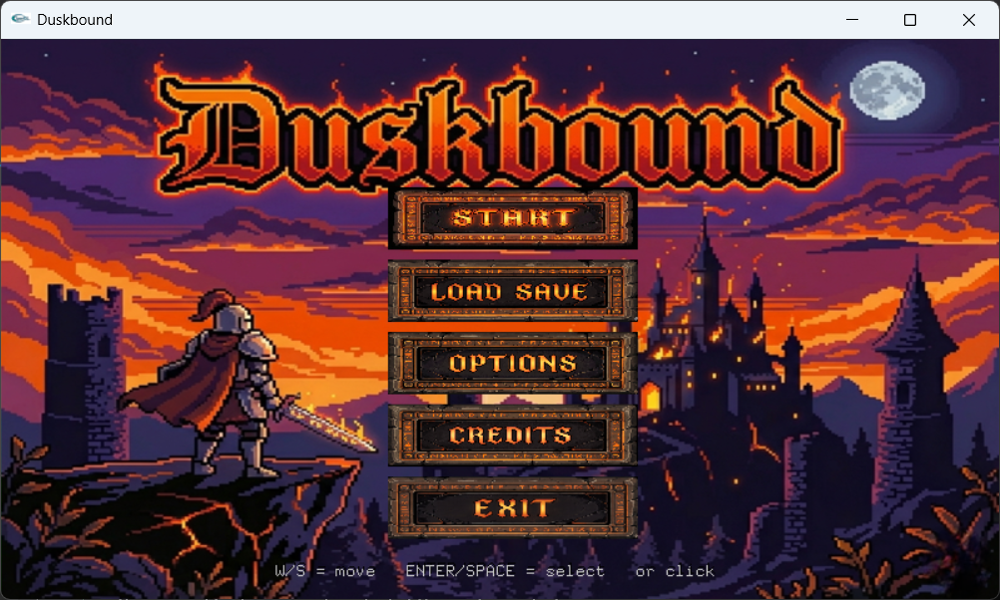
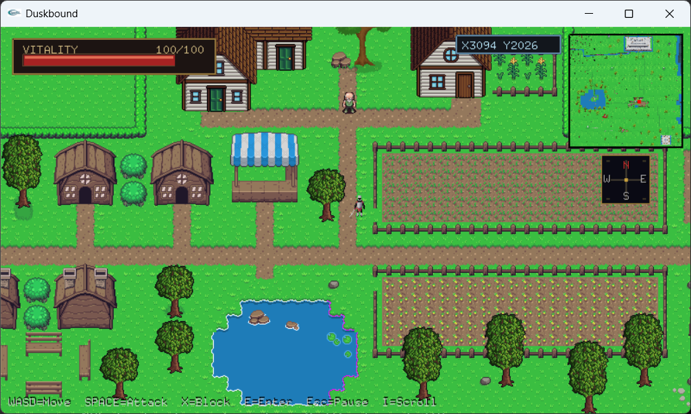
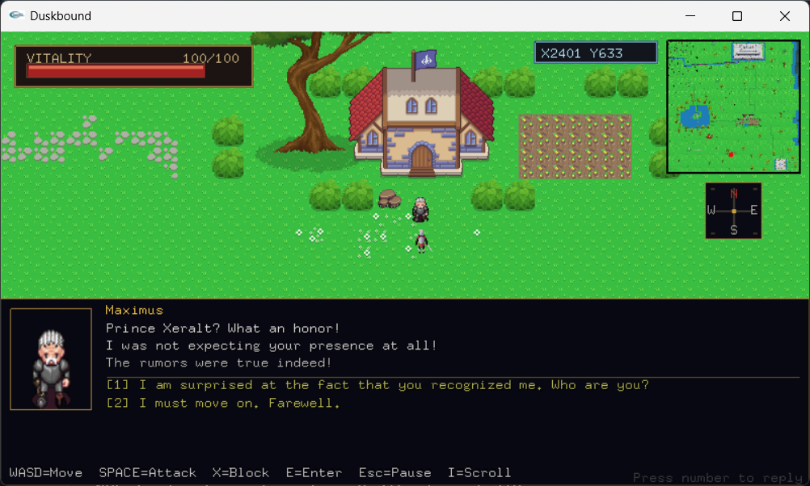
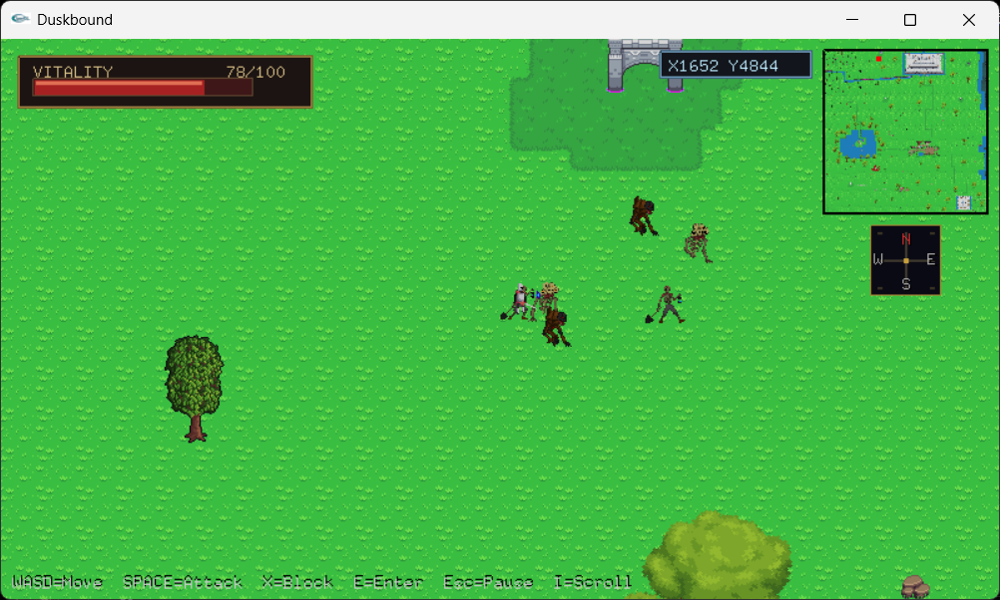
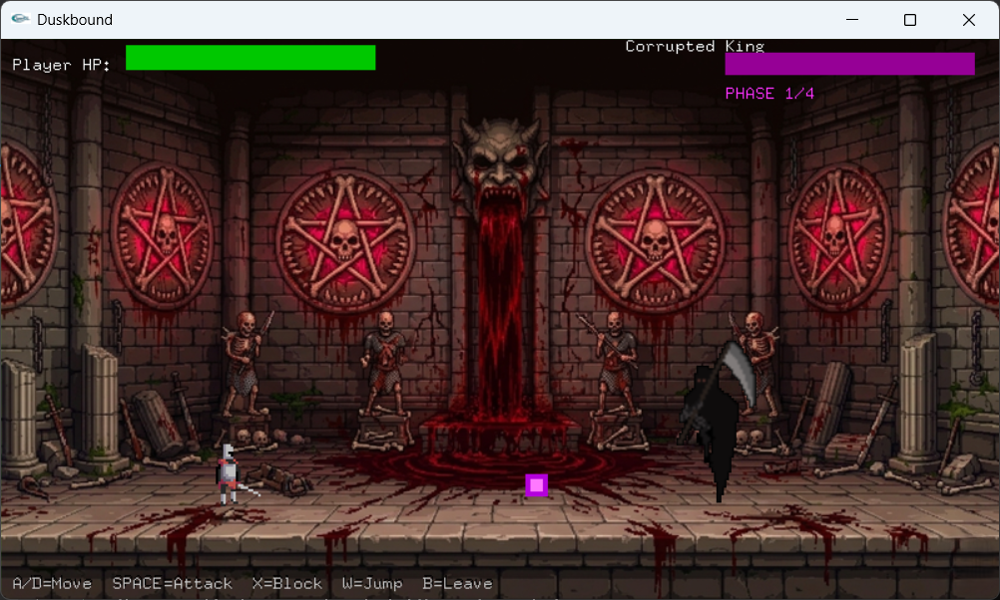

# DUSKBOUND

## Game Description

**DUSKBOUND** is a 2D open-world action RPG built with the **iGraphics** library in **C++**. Players control **The Knight** as they explore a vibrant yet mysterious world, gain powerful upgrades, defeat major bosses, and uncover the secrets of the world.

## Features

- Story-driven introduction and boss cutscenes
- Large explorable overworld with quest-based progression
- NPC dialogue and interaction system
- Three major boss encounters:
  - Outer Wall Guardian
  - Sanctum Sorcerer
  - Corrupted King
- Dedicated boss combat with phase-based gameplay
- Power-up system featuring speed, sword, and defense upgrades
- Quest scroll for tracking objectives
- Save/load system with rename and delete support
- Background music and sound effects
- Health, blocking, melee combat, and overworld enemy encounters

## Project Details

**Project Name:** DUSKBOUND  
**Language:** C++  
**Graphics Library:** iGraphics  
**Platform:** Windows PC  
**IDE:** Visual Studio 2013  
**Project Type:** 2D Open-World Action RPG

## How to Run the Project

Make sure the following are available:
- **Visual Studio 2013**
- **Windows x86 build environment**
- **iGraphics libraries**

This project already includes the required iGraphics/OpenGL-related vendor files in the repository.

### Build and Run

- Open **Duskbound.sln** in **Visual Studio 2013**
- Select **Debug | Win32**
- Click **Build -> Build Solution**
- Run the project using **Debug -> Start Without Debugging**

Make sure the `assets` folder stays in the correct relative location beside the executable. Otherwise, images and audio files may not load properly.

## How to Play

### Overworld Controls

| Action | Key |
|--------|-----|
| Move Up | `W` |
| Move Left | `A` |
| Move Down | `S` |
| Move Right | `D` |
| Attack | `SPACE` |
| Block | `X` |
| Interact / Enter Area | `E` |
| Pause | `ESC` |
| Quest Scroll | `I` |
| Back | `B` |

### Boss Fight Controls

| Action | Key |
|--------|-----|
| Move Left | `A` |
| Move Right | `D` |
| Jump | `W` |
| Attack | `SPACE` |
| Block | `X` |
| Leave Boss Area | `B` |

## Gameplay Objective

- Explore the kingdom and follow the quest path
- Interact with NPCs to uncover the story and progress through the world
- Survive overworld enemy encounters
- Collect upgrades that improve mobility, offense, and defense
- Defeat the first boss to unlock the Sanctum
- Defeat the Sanctum Sorcerer to reveal the Throne Room
- Defeat the **Corrupted King** to complete the journey and save the kingdom

## Save System

- Starting a new game creates a fresh save slot
- The game supports loading saves from both the main menu and pause menu
- Save slots can be renamed or deleted
- Progress is preserved through the built-in save system

## Project Contributors

- **Reshad Ahmed Lamim** — Designed and implemented the main menu, cutscenes, pause scene, minimap, and sound system  
**ID:** 00724205101076

- **Muntasir Rabbi Shoscha** — Story design, world design, map implementation, NPC quests and dialogues, power-ups, inspection monologues, score system (boss fights), and the credits page  
**ID:** 00724205101079

- **Md. Raiyan Hussain Choudhury** — Designed and implemented bosses and player characters, HUD elements, world collision, NPCs, overworld creatures, combat mechanics, the inventory and save system, score system (overworld fights), and the game over scene  
**ID:** 00724205101067

## Screenshots

### Main Menu


### Village Exploration


### NPC Interaction


### Overworld Creatures


### Boss Fight


## YouTube

[Gameplay Video](https://youtu.be/OBFbK9cdo54?si=jsQFe-tMdkCxC2iK)

## Repository Structure

```text
DUSKBOUND/
├── README.md
├── screenshots/
│   ├── BossFightScreen.png
│   ├── Menu.png
│   ├── NPCInteraction.png
│   ├── OverworldCreatures.png
│   └── VillageExplorationView.png
├── Duskbound.sln
├── Debug/
│   ├── Duskbound.exe
│   └── assets/
├── Duskbound/
│   ├── iMain.cpp
│   ├── bosses/
│   ├── core/
│   ├── entities/
│   ├── scenes/
│   ├── systems/
│   └── vendor/
```
